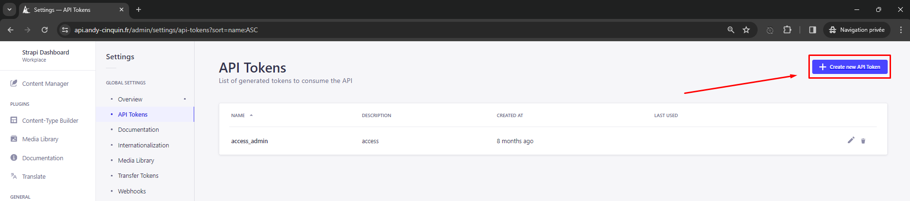

# 🚀 Strapi Exporter: Supercharge Your Obsidian-to-Strapi Workflow

[](https://github.com/CinquinAndy/notes-to-strapi-export-article-ai/releases)
[](https://github.com/CinquinAndy/notes-to-strapi-export-article-ai/blob/main/LICENSE)
[](https://github.com/sponsors/CinquinAndy)

Strapi Exporter is a game-changing Obsidian plugin that streamlines your content creation process by seamlessly exporting your notes to Strapi CMS. With its AI-powered image handling and SEO optimization features, you can take your content to the next level with just a few clicks.

## ✨ Features

- 🖼️ Automatically upload images from your notes to Strapi
- 🎨 Generate SEO-friendly alt text and captions for images using AI
- 📝 Create SEO-optimized article content based on your notes
- 🔧 Customize the JSON template for the article fields in Strapi
- ⚙️ Easy configuration for Strapi API URL, token, and content attribute name

## 🛠️ Installation

### For users:

1. Download the latest release from the [releases page](https://github.com/CinquinAndy/notes-to-strapi-export-article-ai/releases/tag/)
2. Download the `main.js` file & `manifest.json` from the latest release.
3. Create a folder named `notes-to-strapi-export-article-ai` in your Obsidian plugins folder (usually located at `<vault>/.obsidian/plugins/`).
4. Move the `main.js` file & `manifest.json` to your Obsidian plugins folder (usually located at `<vault>/.obsidian/plugins/`).
5. Restart Obsidian
6. Enable the plugin in Obsidian's settings under "Community plugins".
7. Configure the necessary settings (see the Configuration section below). 
8. Enjoy!

### For developers:

To install Strapi Exporter, follow these steps (coming soon to the Obsidian plugin marketplace):

1. Clone this repository into your Obsidian plugins folder (usually located at `<vault>/.obsidian/plugins/`).
2. Run `npm install` to install the dependencies
3. Run `npm run build` to build the plugin
4. Restart Obsidian
5. Enable the plugin in Obsidian's settings under "Community plugins".
6. Configure the necessary settings (see the Configuration section below).

## ⚙️ Configuration

To get started with Strapi Exporter, you'll need to configure the following settings:

- **Strapi URL**: The URL of your Strapi instance (e.g., `https://your-strapi-url`).

- **Strapi API Token**: Your Strapi API token for authentication. You can create an API token in your Strapi admin panel under "Settings" > "API Tokens".


- You need, at least, to have the following permissions:
  - article: create
  - upload: create
  - (you can also add full permissions, but it's not really recommended for security reasons)

  - (the token in the screenshot is not valid, don't try to use it 😌)
- **OpenAI API Key**: Your OpenAI API key for using GPT-3 to generate SEO-friendly content. You can get your API key from the [OpenAI website](https://platform.openai.com/account/api-keys).

  - this key is needed to use the GPT-3 API, which is used to generate the content of the article
  - (it need to access to "Model capabilities" with "write" permission)

  - (or with the "all" permission)
- **JSON Template**: The JSON template for the article fields in Strapi. Customize this according to your Strapi content type structure. You can find the JSON template in your Strapi API documentation (Swagger).

  - to get the JSON template, you can go to the documentation of your Strapi API, and copy the JSON template of the article creation
  - it should look like this: ``https://{api_url}/documentation/v1.0.0``
  - then, go to the article creation, and copy the JSON template


  - it should look like this for example:
```json
{
  "data": {
    "title": "string",
    "seo_title": "string",
    "seo_description": "string",
    "slug": "string",
    "excerpt": "string",
    "links": [
      {
        "id": "number",
        "label": "string",
        "url": "string"
      }
    ],
    "subtitle": "string",
    "type": "string",
    "rank": "number",
    "tags": [
      {
        "id": "number",
        "name": "string"
      }
    ],
    "locale": "string"
  }
}
```
- then, you can copy this JSON template in the settings of the plugin
- and copy that, to describe each field in the other JSON description setting
- **JSON Template Description**: A description for each field in the JSON template to help GPT-3 understand the structure. Follow the same schema as the JSON template to provide descriptions for each field.
```json
{
  "data": {
    "title": "<Title of the item, as a short string>",
    "seo_title": "<SEO optimized title, as a short string>",
    "seo_description": "<SEO optimized description, as a short string>",
    "slug": "<URL-friendly string derived from the title>",
    "excerpt": "<A short preview or snippet from the content>",
    "links": [
      {
        "id": "<Unique identifier for the link, as a number>",
        "label": "<Display text for the link, as a short string>",
        "url": "<URL the link points to, as a string>"
      }
    ],
    "subtitle": "<Subtitle or secondary title, as a short string>",
    "type": "<Category or type of the item, as a short string>",
    "rank": "<Numerical ranking or order priority, as a number>",
    "tags": [
      {
        "id": "<Unique identifier for the tag, as a number>",
        "name": "<Name of the tag, as a short string>"
      }
    ],
    "locale": "<Locale or language code, as a short string>"
  }
}
```
```
⚠️⚠️⚠️⚠️⚠️⚠️⚠️⚠️⚠️⚠️⚠️⚠️⚠️⚠️⚠️⚠️⚠️⚠️⚠️⚠️⚠️⚠️⚠️⚠️⚠️⚠️⚠️⚠️⚠️⚠️⚠️⚠️
⚠️
⚠️ **Important:** Remove the `content` (or the attribute name that correspond to the main content of the article) 
⚠️ field from the JSON template and specify it separately in the "Strapi Content Attribute Name" setting.
⚠️ ( i do that to avoid changes on the main content by chat gpt )
⚠️
⚠️⚠️⚠️⚠️⚠️⚠️⚠️⚠️⚠️⚠️⚠️⚠️⚠️⚠️⚠️⚠️⚠️⚠️⚠️⚠️⚠️⚠️⚠️⚠️⚠️⚠️⚠️⚠️⚠️⚠️⚠️⚠️
```
- **Strapi Article Create URL**: The URL to create articles in Strapi (e.g., `https://your-strapi-url/api/articles`).
  - to get the URL, you can go to the documentation of your Strapi API, and copy the URL of the article creation
  - it should look like this: ``https://{api_url}/documentation/v1.0.0``
  - then, go to the article creation, and copy the URL
- **Strapi Content Attribute Name**: The attribute name for the content field in Strapi (e.g., `content`). 
  - to get the attribute name, you can go to the documentation of your Strapi API, and copy the attribute name of the article creation, (it need to be the name of the attribute that contain the main content of the article, for me it's "content", but it can be different for you)
- **Additional Prompt** (optional): Additional prompt to provide context for GPT-3 when generating content. You can use this field to specify additional information or instructions for the AI model. Like your langage, the tone of the article, etc.

## 🚀 Usage

1. Open a Markdown file in Obsidian.
2. Click on the plugin's ribbon icon to start the magic.
3. Sit back and relax while Strapi Exporter does the heavy lifting:
    - 🖼️ Extracting and uploading images to Strapi
    - 🎨 Generating SEO-friendly alt text and captions for images
    - 📝 Creating SEO-optimized article content based on your notes
    - 🌐 Publishing the article to Strapi with the generated content and images
4. Enjoy your freshly exported article in Strapi!

## 🤝 Contributing

We welcome contributions from the community! If you have any ideas, suggestions, or bug reports, please open an issue or submit a pull request. Let's make Strapi Exporter even better together!

## 📜 License

This project is licensed under the MIT License. See the [LICENSE](LICENSE) file for details.

---

🌟 Elevate your content workflow with Strapi Exporter and unleash the full potential of your Obsidian notes! 🌟

### Roadmap

- [ ] Make it available as a plugin in Obsidian
- [ ] Add tests
- [ ] Renovate
- [ ] ajouter l'étape de création du plugin (création du folder)
- [ ] ajouter l'étape de redémarrage d'obsidian
- [ ] ajouter l'étape de configuration du plugin
  - [ ] ajouter l'étape de configuration du token d'access de strapi (accès etc)

