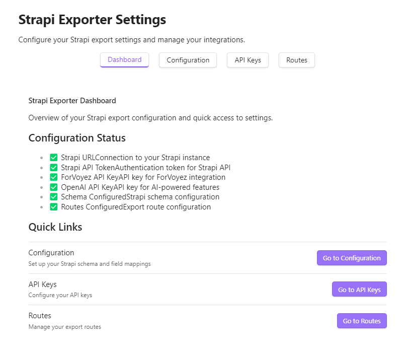
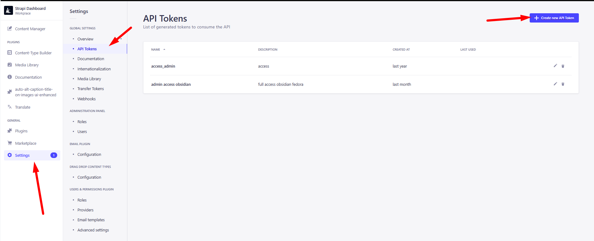

# 🚀 Strapi Exporter: Supercharge Your Obsidian-to-Strapi Workflow

[](https://github.com/CinquinAndy/notes-to-strapi-export-article-ai/releases)
[](https://github.com/CinquinAndy/notes-to-strapi-export-article-ai/blob/main/LICENSE)
[](https://github.com/sponsors/CinquinAndy)

Strapi Exporter is a game-changing Obsidian plugin that streamlines your content creation process by seamlessly exporting your notes to Strapi CMS. With its AI-powered image handling and SEO optimization features, you can take your content to the next level with just a few clicks.
! This plugin was totally refactored, since the 3.0.0 version ! Restart your configuration !

## ✨ Key Features

- 🔄 Multiple Export Routes
  - Configure different export paths for various content types
  - Customizable field mappings per route
  - Support for multiple languages

- 🤖 AI-Powered Content Processing
  - Automatic frontmatter generation
  - SEO optimization
  - Content analysis and enhancement

- 📷 Advanced Image Management
  - Automatic image upload to Strapi
  - Support for both single images and galleries
  - Image path management and updates

- 🔧 Flexible Configuration
  - JSON schema-based configuration
  - Custom field mappings
  - Language-specific settings


## 🛠️ Installation

### For users:

1. Download the latest release from the [releases page](https://github.com/CinquinAndy/notes-to-strapi-export-article-ai/releases/tag/)
2. Download the `main.js` file & `manifest.json` from the latest release.
3. Create a folder named `notes-to-strapi-export-article-ai` in your Obsidian plugins folder (usually located at `<vault>/.obsidian/plugins/`).
4. Move the `main.js` file & `manifest.json` to your Obsidian plugins folder (usually located at `<vault>/.obsidian/plugins/`).
5. Restart Obsidian
6. Enable the plugin in Obsidian's settings under "Community plugins".
7. Configure the necessary settings (see the Configuration section below).
8. Enjoy!

### For developers:

To install Strapi Exporter, follow these steps (coming soon to the Obsidian plugin marketplace):

1. Clone this repository into your Obsidian plugins folder (usually located at `<vault>/.obsidian/plugins/`).
2. Run `npm install` to install the dependencies
3. Run `npm run build` to build the plugin
4. Restart Obsidian
5. Enable the plugin in Obsidian's settings under "Community plugins".
6. Configure the necessary settings (see the Configuration section below).

### To contribute or debug

1. Install the plugin in a new fresh vault
2. Go in community plugin (parameters -> community plugins)
3. Install a random plugin, and enable plugin
4. Go in the plugin folder in your obsidian folder vault (.obisian/plugins)
5. Clone the repo there, and enable the plugin
6. Don't forgot to install the plugin https://github.com/pjeby/hot-reload/ too
7. (Download the zip, and extract the folder in /plugins folder)
8. Enable both plugins
9. Press ctrl + shift + i to enable the dev console
10. Go in hotkeys configuration, search "reload" and enable the hotkey "Reload app without saving". (with ctrl+r)
11. Close & Reopen // ctrl + r your vault
12. Go in the plugin folder & run "npm run dev"

## ⚙️ Configuration

To get started with Strapi Exporter, you'll need to configure the following settings:


### 1. Go in "API Keys" tab
- (required) Add your Strapi API URL
    It's the link to your Strapi API, for example: `https://api.yourdomain.com`

- (required) Add your Strapi API Token

  (settings -> api tokens -> create new API Token)
then, give it the right permissions (at least, upload, and create permissions on the content type you want to use)
  (or just use a full-access token [in Token type configuration])
- (required) Add your OpenAI API Token

you need to create an account on OpenAI, and create an API key, then add it here
- (optional to improve the results) Add your ForVoyez API Token

### 2. Go in "Routes" tab
- Add a new route
- Give it a name, icon, url, subtitle
- for example, 
  - name : articles
  - icon : bird
  - url : /api/articles
  - subtitle : Create articles
- You can add multiple routes, for example, one for articles, one for pages, one for categories, etc.


### 3. Go in "Configuration" tab
- For each route, you can configure the fields you want to use, and the schema needed for the fields
in Strapi, go in Documentation -> Open Documentation

You will see the openapi schema, you can use it to create the schema for the fields you want to use

You need to check the POST method, and the schema needed for the fields you want to use

Copy the whole schema in the Strapi schema section in the obsidian plugin


Then, you need to describe the content you want to use, and you want to upload at the end,
in schema description, for exemple for me :
in Strapi Schema
```
{
  "data": {
    "title": "string",
    "content": "string",
    "seo_title": "string",
    "seo_description": "string",
    "slug": "string",
    ...
  }
```
In Strapi Description (just describe with your words the fields, to help the AI to understand what you want) : 
```
{
  "data": {
    "title": "the title of the article",
    "content": "the content normal of the article",
    "seo_title": "the seo optimized version of the title",
    "seo_description": "a summary of the content, seo optimized, for the seo optimized description",
    "slug": "the-slug-for-the-access-of-the-article",
    ...
  }
```


- And now, in the content field name, you need to write the main content attribute name, for example, in my case, it's "content"
it because we want to avoid the AI to rewrite the content field. (it's already written by us)


- Select the target Language. 


- click on "Generate Configuration", and wait the configuration to be generated
- check if it's coherent with what you want, and click on "Apply"


- Repeat the process for each route you want to use, (you can select an another route with the dropdown menu [select route])
- Reload the plugin (ctrl + r) to apply the changes


## 🚀 Usage

YOU NEED TO HAVE FINISHED THE CONFIGURATION BEFORE USING THE PLUGIN

1. Open a Markdown file in Obsidian.
2. Click on the plugin's ribbon icon to start the magic.

3. if you haven't any frontmatter, click on "Generate" to generate the frontmatter
4. you can change the frontmatter if you want, directly in the file
5. Check if the frontmatter is correct, and click on "Confirm & Export"
6. Enjoy your freshly exported article in Strapi!


## 🤝 Contributing

We welcome contributions from the community! If you have any ideas, suggestions, or bug reports, please open an issue or submit a pull request. Let's make Strapi Exporter even better together!

## 📜 License

This project is licensed under the MIT License. See the [LICENSE](LICENSE) file for details.

---

🌟 Elevate your content workflow with Strapi Exporter and unleash the full potential of your Obsidian notes! 🌟
